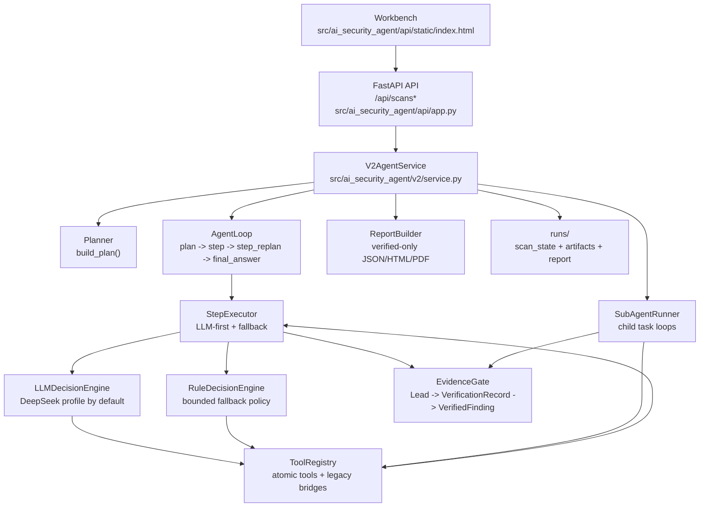
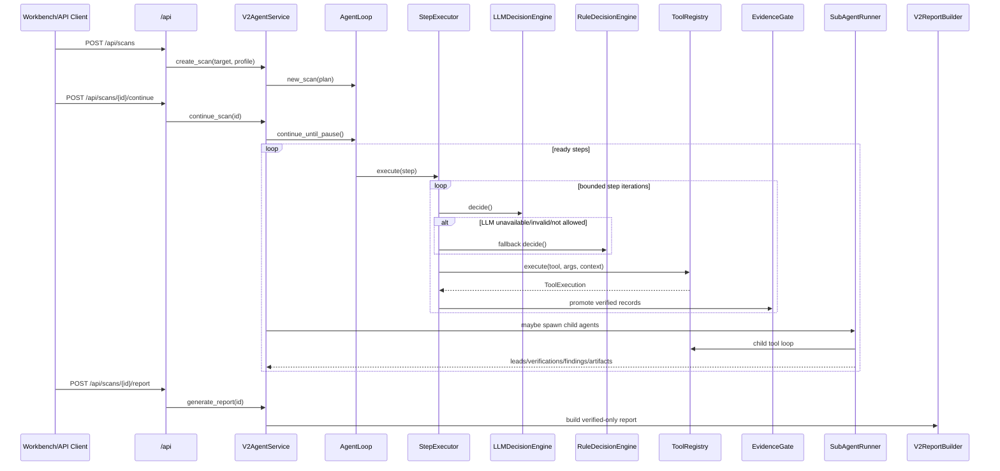

# V2 Takeover Analysis

Date: 2026-06-19

## Baseline

- Workspace: `C:\Users\ASUS\Desktop\python_mvp`
- Handoff source: `C:\Users\ASUS\Desktop\codex交付.docx`
- Reference project extracted to: `C:\Users\ASUS\Desktop\python_mvp\_analysis\xalgorix-main\xalgorix-main`
- Baseline test command:

```powershell
.\.venv\Scripts\python.exe -m unittest discover -s tests -v
```

- Result: `Ran 61 tests in 47.310s - OK`

## Current Architecture



## Current Execution Flow



## xalgorix Model Summary

Reference files inspected:

- `internal/agent/agent.go`
- `internal/tools/registry.go`
- `internal/tools/reporting/reporting.go`
- `internal/agent/hooks.go`
- `internal/tools/httpclient/httpclient.go`

Key execution traits to borrow:

1. Single continuous LLM loop with message history.
2. Tool calls are emitted by the model and parsed from XML.
3. Tool result is appended back into conversation as the next user-observable feedback.
4. Tool registry exposes schema to the model and validates required parameters.
5. Hooks track progress, stuck loops, WAF/tech signals, finish attempts, and coverage gaps.
6. Report tool enforces exploit-before-report and rejects weak/false-positive findings.
7. UI receives live event stream: thinking, tool_call, tool_result, message, error, finished.

## Current Project Strengths

- Current API/UI/report path is already established.
- `StepExecutor` already runs multi-round action/observation loops.
- `DecisionRecord`, `Observation`, `Lead`, `VerificationRecord`, and `VerifiedFinding` are structured.
- Reports are verified-only and include `verification_records`, `proof_type`, and `evidence_bundle`.
- Child agents exist for JS-derived API, XSS multi-entry, auth differential, and backup source audit.
- SQL assets are valuable and already partially atomized:
  - `discover_sql_candidates`
  - `probe_sql_boolean`
  - `generate_sql_bypass_plan`
  - `run_sql_bypass_probe`
  - `run_waf_bypass_strategy`
  - `run_sqlmap_safe`
- Tests cover the main v2 acceptance path and currently pass.

## Main Gaps Versus Target Model

### 1. Step prompt is still generic

`LLMDecisionEngine.decide()` builds one broad prompt for every step. It includes allowed tools and recent observations, but does not yet use skill-specific strategy, false-positive rules, verification requirements, stop policy, or tool subset rationale.

Priority: high.

### 2. DecisionRecord needs stronger attribution fields

Current fields include source, tool, args, hypothesis, rationale, model/provider, fallback reason, latency.

Missing fields recommended by handoff:

- `skill_name`
- `step_name`
- `input_summary`
- `observation_refs`
- `verification_goal`
- `decision_confidence`
- `stop_candidate`
- progress/stagnation signals

Priority: high.

### 3. Fallback reason taxonomy is too coarse

Current step fallback reasons are mostly:

- `llm_unavailable`
- `llm_exception`
- `llm_empty`
- `tool_not_allowed:<tool>`

Needed:

- no key / provider unavailable
- timeout
- rate limit
- invalid JSON
- hallucinated tool
- empty decision
- tool not allowed
- schema repair attempted
- step blocked

Priority: high.

### 4. No progress/stagnation guard

The step loop is bounded by iteration/tool budgets, but it does not yet detect repeated equivalent actions, lack of new leads, lack of new artifacts, or lack of verification signal.

Priority: high.

### 5. Child task spec is still light

`SubAgentTask` has goal, target, planned tools, seed artifacts/context, and max iterations. It does not yet model:

- success criteria
- verification gap
- already attempted
- stop conditions
- output contract
- budget details beyond max iterations

Priority: medium-high.

### 6. Backup child is still static

`_run_backup_subagent()` uses a fixed fetch/parse/grep/capture flow. This matches the handoff note that backup child still has a static skeleton.

Priority: medium-high.

### 7. Tool layer still has bridge residue

The current `ToolRegistry` has good primitives, but still bridges older modules:

- `sql_scan_bridge`
- `run_waf_bypass_strategy`
- `run_sqlmap_safe`
- `xss_triage_bridge`
- `ssrf_triage_bridge`
- `permission_bypass_bridge`

Priority: medium.

### 8. Verification gate is useful but not strict enough

`EvidenceGate.promote()` promotes any lead with a verified `VerificationRecord`.

Missing:

- evidence completeness score
- type-specific false-positive guards
- proof requirements per category
- reproducibility requirement enforcement
- explicit reportability gate before final report

Priority: high.

### 9. Telemetry is structured but not xalgorix-live

`AgentEvent` exists and snapshots expose events, but execution is persisted/polled rather than a rich live event stream with every decision/tool/result/guard decision.

Priority: medium.

## Reusable Assets

### Current project

- `src/ai_security_agent/v2/models.py`: structured runtime/result model.
- `src/ai_security_agent/v2/engine.py`: step loop, LLM/fallback decision, evidence gate.
- `src/ai_security_agent/v2/service.py`: scan lifecycle, child spawning, reporting payload, persistence.
- `src/ai_security_agent/v2/tools.py`: current atomic tools and legacy bridges.
- `src/ai_security_agent/v2/skills.py`: skill catalog and child policies.
- `src/ai_security_agent/modules/sql_bypass/*`: important SQL bypass domain asset.
- `skills/**/SKILL.md` and `skill.yaml`: current skill knowledge base.
- `tests/test_v2_engine.py`: strongest regression harness for v2 behavior.

### xalgorix

- `internal/agent/agent.go`: continuous LLM loop pattern and message feedback model.
- `internal/tools/registry.go`: schema exposure, parameter validation, circuit breaker.
- `internal/tools/reporting/reporting.go`: report gate / false-positive rejection ideas.
- `internal/agent/hooks.go`: progress/stuck/finish gate hook model.
- `internal/tools/httpclient/httpclient.go`: structured HTTP tool interface style.

## Recommended Next Implementation Sequence

1. Add skill-specific prompt building in `src/ai_security_agent/v2/engine.py`.
2. Extend `DecisionRecord` with skill/step/verification/progress attribution.
3. Add stagnation/duplicate-action guard to `StepExecutor`.
4. Strengthen fallback taxonomy and persist normalized fallback codes.
5. Add evidence completeness scoring and category-specific promotion guards.
6. Convert backup child from static-only to static prelude + LLM follow-up loop.
7. Continue atomizing HTTP/browser/session tools and reduce bridge dependence.

## First Small Patch Recommendation

Target files:

- `src/ai_security_agent/v2/models.py`
- `src/ai_security_agent/v2/engine.py`
- `tests/test_v2_engine.py`

Scope:

- Add fields to `DecisionRecord`.
- Add a `StepPromptBuilder` or equivalent helper.
- Populate `skill_name`, `step_name`, `verification_goal`, `observation_refs`, and `input_summary`.
- Add tests asserting the new fields are present in step decision records.

This is the smallest safe Phase 1 increment because it improves observability and prompt quality without replacing the existing fallback/runtime behavior.
